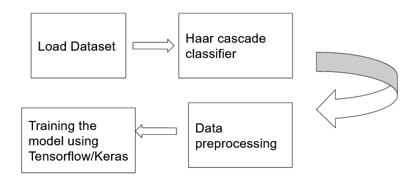
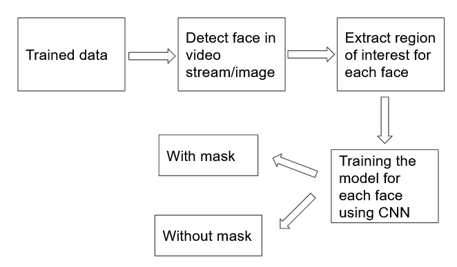
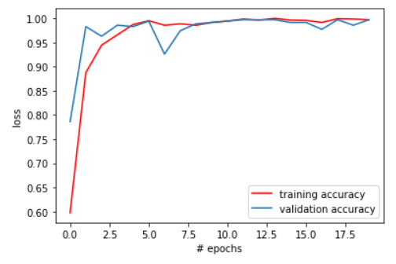
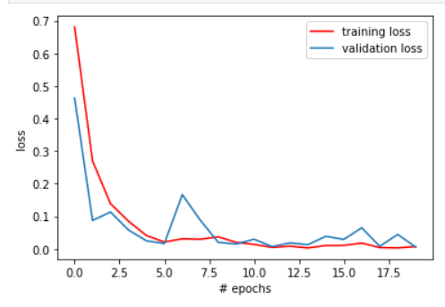
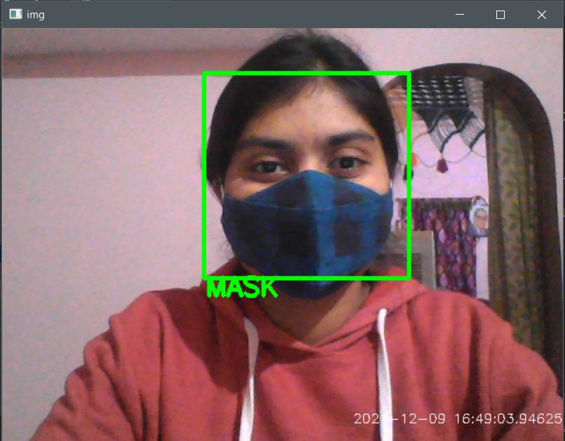
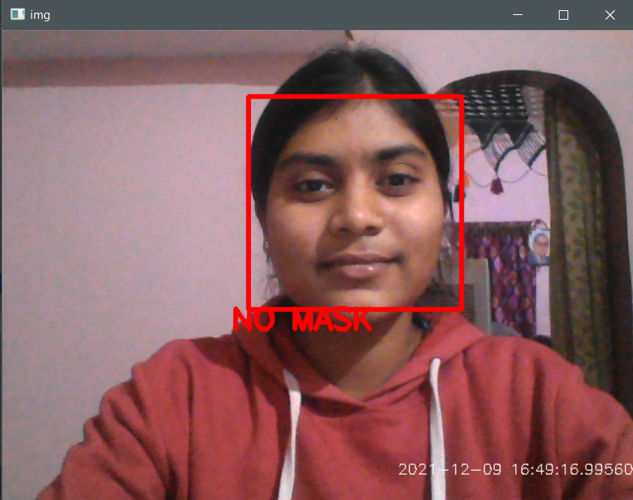

# Face-Mask Detector
Real time face-mask detection using Deep Learning and OpenCV

## About Project
This project uses a Deep Neural Network, more specifically a Convolutional Neural Network, to
differentiate between images of people with and without masks.

Convolutional neural network (CNN) is a type of artificial neural network used in image recognition and processing that is specifically designed to process pixel data.
CNN  extract the feature of image and convert it into lower dimension without losing its characteristics. We have used 2 input convolutional layer the first one is 200 * (3 * 3)and the second one is 100 * (3 * 3).
Each cnn layer is followed by reLU activation to make all negative values to zero and max Pooling Layer to reduce the spatial volume of input image.
The output layer has 2 neurons for the categorical output - without mask and with mask.
The developed architecture is trained for 20 epochs . 

The CNN manages to get an accuracy of **98.2% on the training set** and **97.3% on the test set**. Then the stored weights of this CNN are used to classify as mask or no mask, in real time, using OpenCV.

The method is based on the notion that it learns from preprocessed face images and utilizes CNN model to construct a framework to classify images based on which group it belongs to. This qualified model is saved and used in the prediction.
The model works efficiently with no apparent lag time between wearing/removing mask and display of prediction.

## Dataset

The Dataset from source arxiv.org is collected for training and testing the model. 
Dataset contains images of faces only. It consists of about 2000 images in which 1000 images containing people with face masks and 1000 images containing people without face masks.
For training purposes, 80% images of each class are used and the rest of the images are utilized for testing purposes. 

## Working 

The Face Mask Detection is applied in two different stages:
1) Training the face mask detector

2) Testing the model

## Accuracy Evolution

## Loss Evolution

## Output

The accuracy of the model on the training set is 98.2% and 97.3% on the test set.

### With Mask

### No Mask

